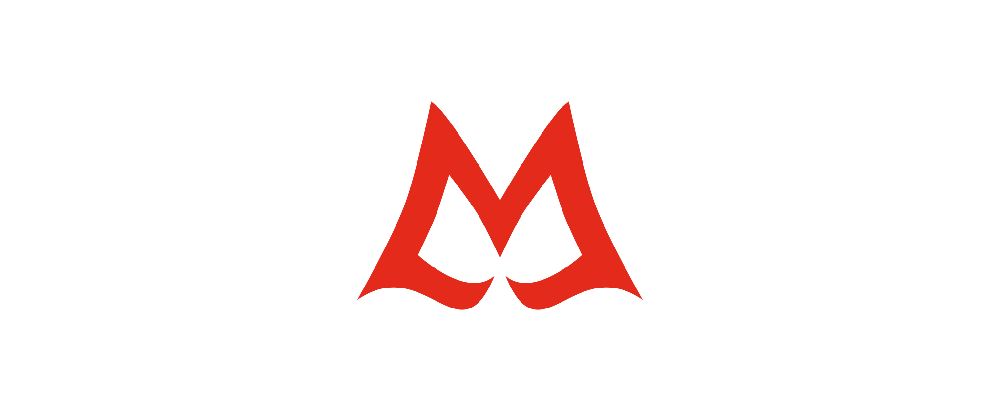

<!--
SPDX-FileCopyrightText: 2025 The SayWare development team

SPDX-License-Identifier: GPL-3.0-or-later
-->

<div align="center">
  <a href="https://github.com/Malware-as-a-Service/SayWare/">
      <!-- markdownlint-disable-next-line line-length -->
    
  </a>

<h3 align="center">SayWare</h3>

<p align="center">
    A simple and harmless malware that says something
    <br />
    <br />
    <a href="https://github.com/">
      <!-- markdownlint-disable-next-line line-length -->
      
    </a>
    <a href="./LICENSES/GPL-3.0-or-later.txt">
      <!-- markdownlint-disable-next-line line-length -->
      
    </a>
    <a href="https://www.microsoft.com/en-us/windows/">
      <!-- markdownlint-disable-next-line line-length -->
      
    </a>
    <a href="https://www.rust-lang.org/">
      <!-- markdownlint-disable-next-line line-length -->
      
    </a>
    <a href="https://reuse.software/">
      <!-- markdownlint-disable-next-line line-length -->
      
    </a>
  </p>
</div>

## :clipboard: Table of content

- [:warning: Disclaimer](#warning-disclaimer)
- [:eyes: About the repository](#eyes-about-the-repository)
  - [:question: Why](#question-why)
- [:rocket: Getting started](#rocket-getting-started)
  - [:gear: Prerequisites](#gear-prerequisites)
  - [:hammer_and_wrench: Run the server](#hammer_and_wrench-run-the-server)
  - [:hammer_and_wrench: Run the malware](#hammer_and_wrench-run-the-malware)
- [:construction_worker: Contributing](#construction_worker-contributing)
- [:books: Licenses](#books-licenses)

## :warning: Disclaimer

This malware isn't intended for real use. Because of this, no advanced
techniques will be and have been used. Don't think this is an example of how
real malware is written.

## :eyes: About the repository

This repository contains harmless malware that displays something in a terminal.
It sends data to the server, which then sends it to the [IngRest] proxy.

### :question: Why

The goal of this malware is to serve as a model for the [MaaS platform][platform].

## :rocket: Getting started

Below are steps to run the server and the malware locally.

### :gear: Prerequisites

You only need [Cargo] to build the project. You will also need the
[nightly][rust nightly] `x86_64-pc-windows-msvc` target and the `rust-src` component.

### :hammer_and_wrench: Run the server

The server will communicate with the [IngRest] proxy. For this reason, if the
data that has been stolen is to be saved in the database, make sure to set up
the proxy and a database.

1. Clone the repository

   ```sh
   git clone https://github.com/Malware-as-a-Service/SayWare/
   ```

1. Change the [environment variables file] as you like and load it

1. Run the server!

   ```sh
   cargo build --bin sayware-server --release
   ```

### :hammer_and_wrench: Run the malware

1. Clone the repository

   ```sh
   git clone https://github.com/Malware-as-a-Service/SayWare/
   ```

1. Change the [malware configuration file] as you like

1. Build the malware!

   ```sh
   cargo build --target x86_64-pc-windows-msvc \
     --bin sayware --profile small-size \
     -Z build-std=core,std,panic_abort \
     -Z build-std-features="optimize_for_size" \
     -Z build-std-features=panic_immediate_abort
   ```

After these steps, the malware will be in the
`./target/x86_64-pc-windows-msvc/small-size/` directory.

## :construction_worker: Contributing

Contributions are what make the open source community such an amazing place to
learn, inspire, and create.\
Any contributions you make are **greatly appreciated**.

If you want, you can help me with any kind of work, for example:

- Correct our English errors
- Licensing stuff

## :books: Licenses

Distributed under the [GPL 3.0 or later] license.

[cargo]: https://doc.rust-lang.org/stable/cargo/
[environment variables file]: ./.env.template
[gpl 3.0 or later]: ./LICENSES/GPL-3.0-or-later.txt
[ingrest]: https://github.com/Malware-as-a-Service/IngRest/
[malware configuration file]: ./malware.toml
[platform]: https://github.com/Malware-as-a-Service/Platform/
[rust nightly]: https://doc.rust-lang.org/book/appendix-07-nightly-rust.html
